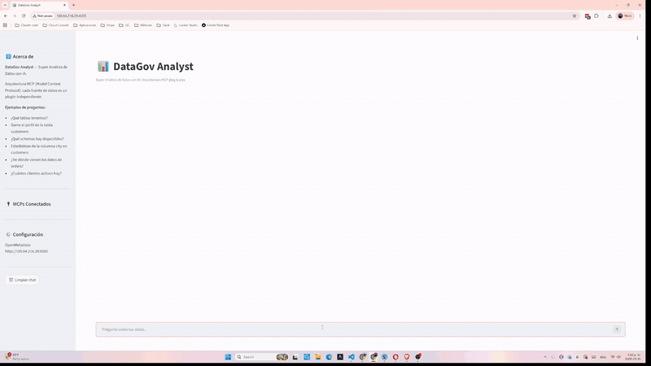

<p align="center">
  <strong>Data Intelligence Lab</strong><br/>
  Reproducible demos across data governance, customer analytics, privacy and governed AI.
</p>

<p align="center">
  
  
  
</p>

---

<p align="center">
  
</p>

## What this is

A single home for the demos and reference implementations behind four areas of work:
**data governance**, **customer analytics**, **data privacy** and **governed AI**.

Each track holds self-contained projects. They are **evidence, not products** — every
project is labelled with what it actually is, so nobody mistakes a 2025 experiment for
something under active maintenance.

## Tracks

| Track | What lives here |
|---|---|
| [`data-governance/`](tracks/data-governance) | Catalog-aware agents: reading metadata, and using it as context before touching data |
| [`governed-ai/`](tracks/governed-ai) | LLM agents with grounded access to data — SQL, RAG, classification |
| [`customer-analytics/`](tracks/customer-analytics) | *(empty)* segmentation, churn, next-best-offer, ARPU, incrementality |
| [`data-privacy/`](tracks/data-privacy) | *(empty)* consent, minimisation, subject rights |

## Projects

| Project | Track | What it does | Maturity | History |
|---|---|---|---|---|
| [`openmetadata-mcp-agent`](tracks/data-governance/openmetadata-mcp-agent) | data-governance | Conversational layer over an OpenMetadata catalog — ask in natural language, answered via MCP tools | `reference` | 35 commits · 2026-03 → 2026-06 |
| [`agent-data-analyst`](tracks/data-governance/agent-data-analyst) | data-governance | Analyses the *data* using the catalog as governance context: who owns the table, did it pass quality, what the codes mean | `reference` · paused | 47 commits · 2026-02 → 2026-06 |
| [`agent-sql-khipu_ai`](tracks/governed-ai/agent-sql-khipu_ai) | governed-ai | LLM agent with SQL access and a RAG knowledge base, local models | `archived snapshot` | 8 commits · 2025-01 → 2025-11 |
| [`agent_text_classification`](tracks/governed-ai/agent_text_classification) | governed-ai | Sentiment classification with a local LLM | `archived snapshot` | 8 commits · 2025-02 |

**The two agents in `data-governance/` are a progression, not a duplicate.**
`openmetadata-mcp-agent` talks *to the catalog*. `agent-data-analyst` analyses *the data*,
using the catalog as context first. Reading them side by side is the point.

## Maturity labels

| Label | Means |
|---|---|
| `maintained` | Actively developed, issues get answered |
| `reference` | Complete and working; kept as a reference implementation, not actively extended |
| `demo` / `POC` | Illustrates one idea; not built to be deployed |
| `archived snapshot` | Preserved **as it was written**, not modernised |

`archived snapshot` is literal: those directories are byte-identical to the repos they
came from. Diff them against the originals — nothing was retouched. Their linter findings
are silenced in `pyproject.toml` rather than patched, because editing a snapshot to look
like it was written today destroys the only thing it is good for.

## History

Every project keeps its **full original history**. Migration used
`git filter-repo --to-subdirectory-filter`, so commits already point at the track path —
`git log`, `git log --follow` and `git blame` all work from the new location:

```bash
git log --oneline -- tracks/data-governance/agent-data-analyst
git log --follow -- tracks/data-governance/agent-data-analyst/agent.py
```

(A plain `git subtree add` leaves the commits pointing at the old paths: the history is in
the graph but is not reachable from the track. That is the difference between moving files
and preserving history.)

## Running a project

Each project keeps its own README, `.env.example` and dependencies. Start there:

```bash
cd tracks/<track>/<project>
cat README.md
```

Nothing here needs credentials to *read*. Projects that connect to a live catalog or
database document what they need in their own `.env.example` — never real values.

## Known gaps

Stated plainly rather than hidden behind a green badge:

- **No test suite yet** in any track. CI runs the linter; the pytest job activates itself
  the moment a `tracks/<track>/<project>/tests/` directory appears. The `test_*.py` files
  under some `scripts/` folders are **manual integration scripts** — they need a live
  catalog, a database and credentials — so CI deliberately does not collect them.
- `customer-analytics/` and `data-privacy/` are empty.
- Dependencies in the migrated projects are declared with ranges, not pinned. A fresh
  install today may not resolve to what the author ran.

## License

MIT — see [LICENSE](LICENSE).
