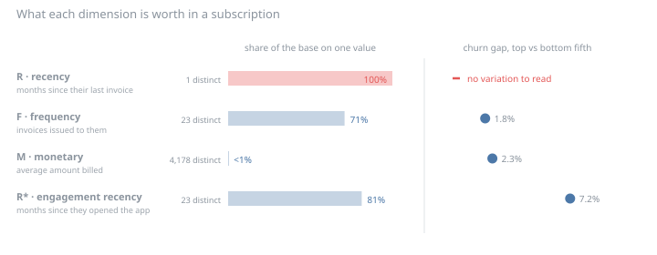
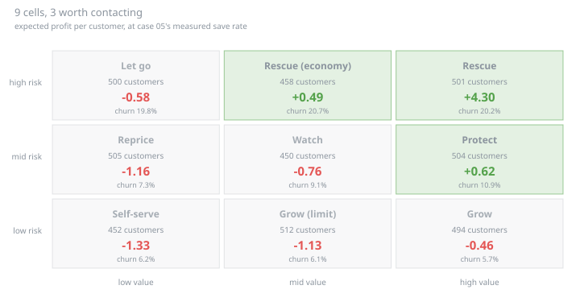
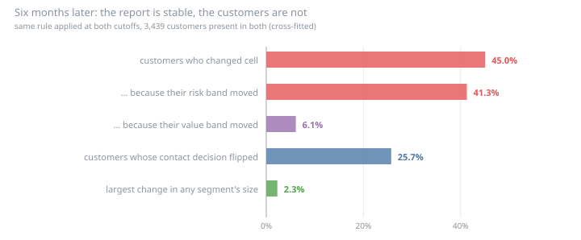
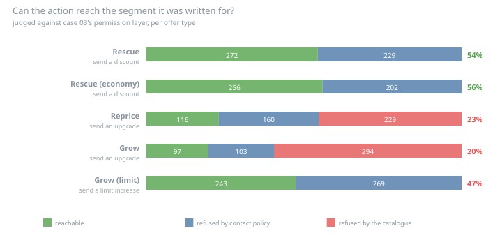

# Actionable segmentation — results

Generated by `uv run run.py`. Every number below is reproducible from the seed;
nothing here is hand-entered. Synthetic data — see `../data-model/DATA_CARD.md`.

## The decision

The base is to be segmented at **2025-12-01** — 4,376 customers, 624 dropped because they left during the earlier window — and each segment is to carry an action for next quarter.

Risk is case 02's churn model, refitted here rather than quoted. Value is the same monthly revenue that case feeds its economics. The save rate behind every expected value is the **12.4%** case 05 measured, not the 25% case 02 had to assume.

The axes are cut into equal thirds. Quantiles rather than round thresholds, deliberately: a rule like *risk above 20%* has to be defended and re-defended as the base rate moves, and this case is not about defending one. Equal thirds are arbitrary in a way that is visible.

## First, the segmentation everyone already has

RFM is the default, it is what a segmentation request usually means, and it is computed here exactly as prescribed — on `billing`, the transaction table of a fintech. Then each dimension is measured.

| | Dimension | Distinct values | Largest single value covers | Churn gap, top vs bottom fifth |
|---|---|---:|---:|---|
| `R` | recency — months since the customer's most recent invoice | 1 | 100% | **no variation to read** |
| `F` | frequency — number of invoices issued to the customer | 23 | 71% | 1.8% |
| `M` | monetary — average amount billed per invoice | 4,178 | <1% | 2.3% |
| `R*` | engagement recency — months since the customer last opened the app | 23 | 81% | 7.2% |

**Recency has no variance at all.** A single distinct value across 4,376 customers — every one of them was invoiced in the most recent month, because that is what a billing run does. Sorting a constant still produces five quintiles, and they still come back with different churn rates, entirely from the order the rows arrived in. That gap is withheld from the table above; printing it is how a constant becomes a finding.

**Frequency is tenure wearing a different name.** Correlation with `tenure_months`: **1.0000**. Not strongly related — the same variable. A customer's invoice count is the number of months they have been a customer, because the invoice is generated by the billing run rather than by a decision to come back.

That is the whole mechanism, and it is a property of the business model rather than of this dataset. RFM reads a customer's repeat-purchase decision. A subscription does not have one: the company decides when to bill, monthly, until somebody stops it. Two of the three dimensions are measuring the company's own schedule. Only `M` survives, and `M` is ARPU.

**The repair is a different event, not a different formula.** Recency rebuilt on app logins — something the customer chooses to do — separates churn by 7.2% between its extreme fifths, against 2.3% for the best of the original three. Recency was always measuring a decision; retail just happened to be a business where the decision and the transaction were the same event.

## The grid, and what it says to do

Two axes, because an action needs two answers that no single score gives: *is this customer leaving?* and *does it matter if they do?* Risk alone spends the retention budget on customers worth less than the offer; value alone spends it on customers who were never going anywhere.

| Segment | Customers | Modelled risk | ARPU | Actual churn | Profit per customer | Measured profile |
|---|---:|---:|---:|---:|---:|---|
| **Rescue** | 501 | 23.4% | 49.86 | 20.2% | +4.30 | usage trend 0.7 sd lower; unresolved escalations 0.6 sd higher; balance carried 0.5 sd higher |
| **Rescue (economy)** | 458 | 23.5% | 19.11 | 20.7% | +0.49 | unresolved escalations 0.8 sd higher; usage trend 0.5 sd lower; active days 0.4 sd lower |
| **Let go** | 500 | 23.5% | 10.29 | 19.8% | -0.58 | unresolved escalations 0.7 sd higher; active days 0.7 sd lower; unused credit limit 0.6 sd higher |
| **Protect** | 504 | 8.8% | 49.27 | 10.9% | +0.62 | balance carried 0.8 sd higher; unresolved escalations 0.3 sd lower; app logins 0.3 sd lower |
| **Watch** | 450 | 8.8% | 19.06 | 9.1% | -0.76 | balance carried 0.4 sd lower; app logins 0.3 sd lower; unresolved escalations 0.3 sd lower |
| **Reprice** | 505 | 8.9% | 10.30 | 7.3% | -1.16 | balance carried 0.4 sd lower; unresolved escalations 0.3 sd lower; unused credit limit 0.3 sd higher |
| **Grow** | 494 | 4.5% | 47.15 | 5.7% | -0.46 | balance carried 1.0 sd higher; unused credit limit 0.7 sd lower; active days 0.7 sd higher |
| **Grow (limit)** | 512 | 4.3% | 19.23 | 6.1% | -1.13 | app logins 0.6 sd higher; usage trend 0.5 sd higher; self-service actions 0.5 sd higher |
| **Self-serve** | 452 | 4.4% | 10.34 | 6.2% | -1.33 | app logins 0.7 sd higher; self-service actions 0.6 sd higher; usage trend 0.5 sd higher |

**The profile column is measured, never written.** Each cell reports the features on which it departs furthest from the base, in units of the base's own spread. Naming a cell *disengaged high-value customers* because the name sounds right is how a segmentation becomes a story, and the story is unfalsifiable by construction.

What comes back is the data model's own causal design, recovered rather than assumed: the high-risk cells are the ones with unresolved escalations and falling usage, the low-risk cells are the ones logging into the app. No cell was told what it should look like.

**6 of the 9 cells lose money on contact.** Only **Rescue**, **Rescue (economy)** and **Protect** clear the cost of contacting the average member, covering 1,463 of 4,376 customers. That is the deliverable, and it is mostly a list of people not to contact — which is the part of a segmentation that survives meeting a budget.

Note the cell that separates the two axes: **Let go** carries the same modelled risk as the rescue cells and a negative expected value, because what it is worth saving is less than what saving it costs. A risk model alone puts those customers at the top of the list.

## Does the segment last long enough to act on?

The data model labels two observation cutoffs 6 months apart, so the same rule can be applied twice and the answer counted instead of assumed.

**45.0% of the base changed cell in 6 months**, and the two axes are not equally to blame: the risk band moved for 41.3% and the value band for 6.1%.

That asymmetry is the structural point. ARPU is the product the customer is on — a commercial fact that changes when somebody signs something. Risk is behaviour, and behaviour is what the model is built to detect moving. **The grid crosses a photograph with a film**, and inherits the refresh rate of the film.

For 25.7% of the base, it is not the label that changed but the decision: they moved between a cell that contacts and a cell that does not.

**Meanwhile the report looks fine.** The largest change in any segment's share of the base is 2.3%. Re-cutting the axes at each refresh keeps every cell the same size by construction, so a segment-size dashboard is flat while 45.0% of the people inside the segments have swapped places. Nothing in the aggregate view can show this.

The largest moves are a legible deterioration path rather than noise:

| From | To | Customers |
|---|---|---:|
| Grow | Protect | 143 |
| Protect | Rescue | 125 |
| Watch | Grow (limit) | 120 |
| Let go | Reprice | 109 |

**This is a floor, and the floor is checked.** Scoring the earlier cutoff with the model fitted on it is in-sample — the score has partly memorised those customers, so they look more like themselves than they are. Measured that way migration is 40.2%; measured cross-fitted, with a model that never saw them, 45.0%. The comfortable method understates the problem, which is the direction that matters, and the figure quoted above is the honest one.

## Can the action be delivered?

A segmentation ends in a sentence like *contact this cell with a retention offer*. Whether that sentence can be executed is a different question, answered by rules the analyst does not own, and normally discovered by the campaign team the week before the send. The rules are not re-implemented here: this is case 03's permission layer, reading the shared `contact_policy` table, asked per offer type rather than per customer.

| Segment | Modelled risk | Customers | Reachable under the contact policy |
|---|---:|---:|---:|
| Rescue | 23.4% | 501 | 309 (62%) |
| Rescue (economy) | 23.5% | 458 | 293 (64%) |
| Let go | 23.5% | 500 | 337 (67%) |
| Protect | 8.8% | 504 | 375 (74%) |
| Watch | 8.8% | 450 | 346 (77%) |
| Reprice | 8.9% | 505 | 390 (77%) |
| Grow | 4.5% | 494 | 375 (76%) |
| Grow (limit) | 4.3% | 512 | 405 (79%) |
| Self-serve | 4.4% | 452 | 364 (81%) |

That column ignores which offer: it is the contact policy on its own. The next one asks the narrower question — can this cell receive the offer *its play prescribes*?

| Segment | Action | Customers | Reachable | Refused by policy | Refused by the catalogue |
|---|---|---:|---:|---:|---:|
| **Rescue** | send a discount | 501 | 272 (54%) | 229 | 0 |
| **Rescue (economy)** | send a discount | 458 | 256 (56%) | 202 | 0 |
| **Reprice** | send an upgrade | 505 | 116 (23%) | 160 | 229 |
| **Grow** | send an upgrade | 494 | 97 (20%) | 103 | 294 |
| **Grow (limit)** | send a limit increase | 512 | 243 (47%) | 269 | 0 |

**The policy leans against the cells that need it.** Judged on whether a customer can receive *any* offer — which is the only version in which the nine cells are comparable, since a play's own reach also depends on its channel — the lowest-risk third of the base is reachable at 78.5% and the highest-risk third at 64.4%, a gap of 14.1 points.

The mechanism is not a coincidence: arrears, an open unresolved complaint and a recent contact are simultaneously the rules that suppress a contact and the facts the risk model reads as danger. Case 03 measured this gate by gate; here it lands on the product.

**What is not claimed:** that reachability falls monotonically with risk. It does not — cell by cell the ordering breaks, and nine cells of a few hundred customers cannot support a nine-step ordering. The direction of the gap between the extreme thirds holds across seeds; its *size* does not — on a smaller world with less contact history it shrinks to a couple of points. So the mechanism is worth designing around and the number is not worth quoting as a constant.

**Two plays in this playbook are not a delivery problem — they are wrong.** *Reprice* and *Grow* are refused more often by the catalogue than by any policy, and the two cases fail for different reasons:

- **Reprice** — 229 of 505 customers have *every* offer of this type refused by a product rule; 229 attributed to *offer not sold to that product family*. The play asks for the product that *fits* a low-usage customer, which is a move down the ladder. Every offer of this type is a move up — `upgrade_to_rank` only points at a higher rank — so the nearest available offer type was the one it got coded to. The catalogue has no entry for what this segment actually needs, and a play cannot be more executable than the catalogue it draws on.
- **Grow** — 294 of 494 customers have *every* offer of this type refused by a product rule; 294 attributed to *already on that product or better*. The cell is the highest-value third of the base, and the highest-value third is, mechanically, the customers already at the top of the product ladder. The action contradicts the definition of the segment it was written for.

They are left in, and reported, rather than quietly fixed. Nothing errors when a play does not apply; the campaign simply under-delivers and the segmentation is not suspected. Separating the two refusal families is what makes it visible at all — a single *unreachable* count would have buried it next to a consent problem, which has an entirely different remedy.

The best-served play reaches 56% of its cell; the worst, 20%.

## Does the grid change what anyone does?

The question a segmentation is rarely asked. The same budget is spent twice on the same customers — once by the continuous ranking cases 02 and 03 already publish, once by the playbook — and both lists are priced with case 02's own profit accounting, imported rather than restated, so the comparison cannot be won by redefining value.

| List | Contacts | Realised profit | Actual churn of those contacted |
|---|---:|---:|---:|
| ranked by expected value | 437 | 1,920 | 24.9% |
| chosen by the playbook | 437 | 1,746 | 21.1% |

The two lists agree on 75.7% of their names, and the ranking wins by 174 — 9.1% of the profit, at identical capacity. Discretising a score into thirds throws away the ordering inside each third, and the budget stops precisely inside one of them.

**That is not an argument against segmenting.** It is an argument against segmenting for *this*. The comparison is only possible because both methods were pointed at one question — *who gets the next contact* — and a single number answers that better than a grid can, which should not be surprising.

What the ranking does not produce is everything else: it assigns no action to the 1,402 customers it never reaches, and it does not say what to send the ones it does. The playbook carries 3 distinct offer types and 3 plays that involve no outbound contact at all. A ranking has no opinion on any of it.

So the honest division of labour is the one the numbers support: **rank to choose who, segment to choose what.** Using the grid as the selector costs 9.1% for nothing, because the ranking was already there.

## The question that comes next, and has no answer here

*Which segment responded best?* It sounds like reporting. Answering it gives the segmentation a causal claim it was never designed to support.

Case 05 established the ceiling: pooled over the whole base, the retention experiment could not distinguish a 25% save rate from 11%, or from zero. Cutting the same experiment by segment divides that evidence again. Read against the answer key — what each customer would have done had the campaign never run — this is what is left:

| Segment | Treated | Outcomes the campaign actually changed | True mean effect |
|---|---:|---:|---:|
| Rescue | 305 | 4 | -0.0131 |
| Rescue (economy) | 253 | 8 | -0.0316 |
| Let go | 243 | 6 | -0.0247 |
| Protect | 257 | 6 | -0.0233 |
| Watch | 193 | 3 | -0.0155 |
| Reprice | 187 | 4 | -0.0214 |
| Grow | 305 | 4 | -0.0131 |
| Grow (limit) | 268 | 6 | -0.0224 |
| Self-serve | 205 | 4 | -0.0195 |

Across the entire base the campaign changed **52 outcomes** among 2,552 treated customers. Split nine ways that is 5.8 per segment, and no segment reach even ten. Every ordering of these rows is decided by which handful of customers sat near their own threshold.

The temptation is real and worth naming: the true effects above are *not* ordered by risk — the strongest belongs to **Rescue (economy)**, not to the segment the whole plan is built around. A reader would like that to mean something. It does not: at these counts the answer key itself is noise, and the correct conclusion is the same one case 05 reached — **this experiment has no per-segment reading**, and that is fixed by designing an experiment, not by slicing this one further.

The table is here because the absence of an answer is the finding. A version of this analysis that quietly dropped the outcome counts would produce nine plausible effect sizes and a recommendation.

## Limitations

- **Equal thirds are a choice, not a finding.** A different cut moves every cell count and every profile in the grid table. What does not move is the shape of the result: two axes with different refresh rates, deliverability inversely related to risk, and a ranking that beats a grid at ranking.
- **One migration measurement, at one gap.** Six months is what the data model labels. Whether the risk band churns faster or slower over one quarter is not observable here, and a quarterly plan is the common case.
- **The value axis is current ARPU, not lifetime value.** A customer's worth is what they pay now, undiscounted, with no expectation of what they would grow into. That flatters the low-tenure high-usage customers in the grow cells.
- **Deliverability is judged against today's consent**, as case 03 also notes: consent has no effective date in the data model, so a retrospective read applies present opt-ins to past decisions.
- **The playbook is one playbook.** Its actions are plausible and one of them is demonstrably wrong, which is the honest state of a first draft — but the plays are not evidence, and nothing here validates that a discount is the right response to the rescue cell. That would take the experiment case 05 shows this data cannot supply.
