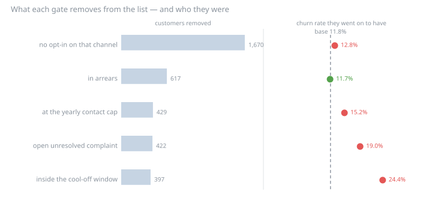
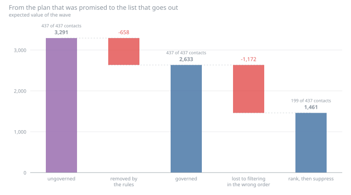
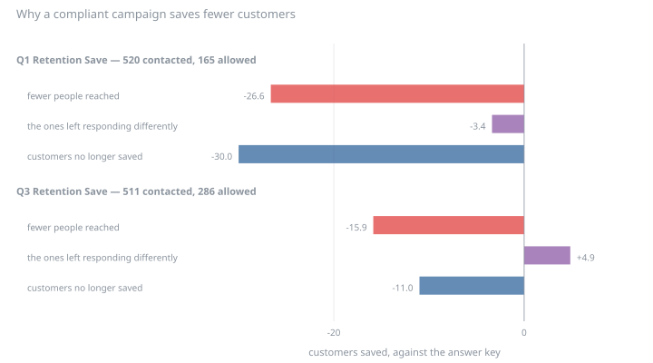

# Governed next-best-offer — results

Generated by `uv run run.py`. Every number below is reproducible from the seed;
nothing here is hand-entered. Synthetic data — see `../data-model/DATA_CARD.md`.

## The decision

One wave, decided at **2025-12-01**: 4,376 customers in scope (624 dropped because they left during the earlier window), a contact capacity of **437**, and 4 offers with response history to choose between.

Risk comes from case 02's model, refitted here rather than quoted. The save rate is the **12.4%** case 05 measured against its control group, not the 25% case 02 had to assume.

## The rules, as data

The contact policy lives in the shared data model (`contact_policy`), not in this code. That is a deliberate modelling choice: a policy that lives in the scoring script is not a policy, it is a preference — unauditable without reading Python, and different in every team's copy.

| Rule | Applies to | Value | Why |
|---|---|---:|---|
| `POL_CONSENT` | everything | required | Outbound contact requires a recorded opt-in on the channel used |
| `POL_COOLOFF` | everything | 270 days | Do not contact a customer again within the cool-off window |
| `POL_FREQ_CAP` | everything | 2 contacts | Cap total outbound contacts per customer per rolling year |
| `POL_ARREARS` | crosssell and upsell | 0 invoices | Do not sell more to a customer who is not paying for what they have |
| `POL_OPEN_ESC` | crosssell and upsell | required | Do not upsell a customer whose open complaint is unresolved |
| `POL_ONE_OFFER` | everything | 1 offer | One offer per customer per wave — competing offers cannibalise each other |

Eligibility is separate and comes from the offer catalogue (`offers.eligible_family`, `offers.upgrade_to_rank`): whether an offer *makes sense* for a customer is a product rule, not a compliance one, and the two have different owners and different failure modes.

## What the campaigns that already ran would fail

Cases 02 and 05 take these audiences exactly as the campaign built them. Judged against the two rules that can be checked in hindsight — consent on the delivery channel, and whether the offer was even applicable — most of what ran was not permitted.

| Campaign | Channel | Contacted | Had opted in | Offer applicable | Both |
|---|---|---:|---:|---:|---:|
| Q1 Retention Save | call | 520 | 31.7% | 100.0% | 165 |
| Q3 Retention Save | sms | 511 | 56.0% | 100.0% | 286 |
| Mid-year Upsell | email | 1,157 | 64.0% | 22.0% | 164 |
| Limit Cross-sell | push | 1,172 | 63.1% | 100.0% | 739 |

**Q1 Retention Save** went out by *call* — the channel with the lowest opt-in in the base — so 68.3% of the people it contacted had never agreed to be contacted that way. Nothing in the campaign report would show this: the response rate is computed over everyone contacted, and a customer who never opted in still answers the phone.

**Mid-year Upsell** is the other failure. It offered *OF_UP_M* to 1,157 customers, of whom only 22.0% were on a plan the offer would actually improve. The rest were sent an upgrade to the plan they already had, or to a worse one. That is not a compliance breach — it is a broken product rule, and it costs response rather than fines.

## Permission is not a random sample

The first thing to check about a gate is whether the people it removes look like the people it keeps. For consent they do not — and not uniformly across channels.

| Channel | Opted in | Churn if opted in | Churn if not | Gap | Bigger than its noise? |
|---|---:|---:|---:|---:|:---:|
| push | 61.5% | 10.7% | 13.5% | +2.76 pp | yes |
| email | 60.2% | 11.7% | 11.8% | +0.08 pp | no |
| sms | 60.1% | 11.5% | 12.2% | +0.74 pp | no |
| call | 36.0% | 10.0% | 12.8% | +2.74 pp | yes |

In the data model engaged customers opt in more, and weak engagement is a churn driver, so consent and risk are linked by construction. The size of that link is the interesting part: it is visible on **push** and **call** and not on the others, and even where it is visible it is worth a couple of points. The customers you are allowed to call churn a little less than the ones you are not.

221 customers of 4,376 have opted out of every channel. They are not a targeting problem; they are unreachable, and any plan that counts them in its addressable base is overstating it.

## What each gate actually removes

Three counts, because one would mislead. **Pairs blocked** is every refusal a rule makes; **sole blocker** counts only the refusals that dropping that one rule would reverse; **customers removed** is the operational number — customers whose *best* offer this rule refuses.

| Rule | Pairs blocked | Sole blocker | Customers removed | Their modelled risk | Their actual churn |
|---|---:|---:|---:|---:|---:|
| `POL_CONSENT` — no opt-in on that channel | 9,715 | 5,367 | 1,670 | 13.0% | 12.8% |
| `POL_ARREARS` — in arrears | 2,181 | 499 | 617 | 8.2% | 11.7% |
| `POL_FREQ_CAP` — at the yearly contact cap | 2,145 | 545 | 429 | 12.6% | 15.2% |
| `POL_OPEN_ESC` — open unresolved complaint | 2,202 | 397 | 422 | 20.4% | 19.0% |
| `POL_COOLOFF` — inside the cool-off window | 1,985 | 293 | 397 | 19.6% | 24.4% |
| `ELIG_FAMILY` — offer not sold to that product family | 2,404 | 623 | 0 | — | — |
| `ELIG_NOT_AN_UPGRADE` — already on that product or better | 4,851 | 1,471 | 0 | — | — |

The wave's own churn rate is **11.8%**. A gate that removed a random slice of the base would sit on that number. Instead the groups they remove spread from 11.7% to 24.4% around it, in both directions:

- **`POL_COOLOFF` removes the customers most likely to leave** — 397 customers who went on to churn at 24.4%, against a base of 11.8%. It is not a targeting rule and nobody thinks of it as one, but it is the most selective thing in the policy. The mechanism is circular: they were contacted last quarter *because* they were high risk, and they are barred this quarter for having been contacted.
- **`ELIG_FAMILY`, `ELIG_NOT_AN_UPGRADE` block 7,255 pairs and remove nobody.** The offers they refuse were never anyone's best offer, so the refusal changes no decision. This is the whole reason the first column is a bad cost metric — and note it does not contradict the audit above: a campaign *sent* those ineligible offers; an engine that scores them simply never picks them.

## The cool-off window is a step, not a dial

Campaigns happen on dates, so a rule written in days is flat until it crosses one and then jumps. Sweeping the window:

| Cool-off | Customers suppressed | Their modelled risk | Reachable | Plan expected value |
|---:|---:|---:|---:|---:|
| 0 d | 0 | — | 3,391 | 2,705 |
| 30 d | 0 | — | 3,391 | 2,705 |
| 60 d | 0 | — | 3,391 | 2,705 |
| 90 d | 0 | — | 3,391 | 2,705 |
| 120 d | 0 | — | 3,391 | 2,705 |
| 150 d | 0 | — | 3,391 | 2,705 |
| 180 d | 0 | — | 3,391 | 2,705 |
| 210 d | 397 | 19.6% | 3,194 | 2,633 |
| 240 d | 397 | 19.6% | 3,194 | 2,633 |
| 270 d | 397 | 19.6% | 3,194 | 2,633 |
| 300 d | 1,369 | 13.4% | 2,600 | 2,373 |
| 330 d | 1,369 | 13.4% | 2,600 | 2,373 |
| 365 d | 1,369 | 13.4% | 2,600 | 2,373 |

The policy is set at **270 days**. At 180 it suppresses nobody; the last campaign is just outside the window. A month further out and it suppresses 397 customers whose modelled risk is 19.6% — the retention audience from two quarters ago, arriving in one lump.

Widen it further and the suppressed group *grows and gets safer*, because the window starts reaching campaigns that were not targeted on risk. The cost of this rule is not a smooth trade-off anybody tuned. It depends on where the edge falls relative to a campaign calendar nobody consulted when the number was written down.

## Three lists

The same scores and the same rules, assembled three ways.

| List | Contacts | Capacity used | Expected value | Modelled risk | Actual churn | Retention profit booked |
|---|---:|---:|---:|---:|---:|---:|
| ungoverned (what the plan promised) | 437 | 100.0% | 3,291 | 17.0% | 14.9% | 1,107 over 168 contacts |
| governed (filter, then rank) | 437 | 100.0% | 2,633 | 11.8% | 8.9% | 445 over 106 contacts |
| rank, then suppress | 199 | 45.5% | 1,461 | 14.5% | 8.5% | 253 over 68 contacts |

**Governance costs 658 of expected value** (20.0% of the ungoverned plan). That is the number worth arguing about, and it is the smaller one.

**Doing the same governance in the wrong order costs 1,172 more** — 1.8× the rules themselves. Ranking first and suppressing afterwards sends **199 contacts against a capacity of 437**: 238 slots are freed by suppressed customers and never refilled. Nothing errors. The campaign reports that it contacted the top of the list, and it contacted 45.5% of it.

The last two columns are the part that is not about money. The ungoverned list contacts customers who went on to churn at 14.9%; the governed list, 8.9%. The rules do not scale the programme down — they point it somewhere else. Only 49.4% of the governed list appears in the ungoverned one.

The offer mix moves with it:

| List | OF_DISC10 | OF_LIM5 | OF_UP_M | OF_WAIVE |
|---|---:|---:|---:|---:|
| ungoverned (what the plan promised) | 0 | 139 | 130 | 168 |
| governed (filter, then rank) | 8 | 237 | 94 | 98 |
| rank, then suppress | 0 | 70 | 61 | 68 |

## The offer nobody has ever sent wins the auction

The catalogue has 5 offers. **OF_UP_L** (*Upgrade to L*) has never been in a campaign, so there is no response history behind it and no honest way to estimate acceptance for it. It is held out of the plan above.

Score it anyway — with the acceptance model fitted on the offer that *did* run, which is what an engine does by default — and it takes **320 of the 437 slots** and lifts the plan's expected value from 2,633 to 4,590, a 74% improvement made entirely of an assumption.

The mechanism is ordinary: OF_UP_L moves customers further up the price ladder than the offer that has history, so the same acceptance probability buys a bigger margin. There is no variation in the data from which the price sensitivity could be estimated — one upgrade offer has ever run — so nothing can correct it. The offer with the least evidence gets the most confident number, and a forecast built on it will be missed by a wide margin for reasons the model cannot report.

## The evidence inherits the violation

The acceptance model is fitted on customers the campaigns contacted. Going forward the policy only permits contact with the ones who had opted in — so part of the training data describes a population that can no longer be addressed.

| Objective | Rows | Rows from permitted contacts | Lost | Acceptance (all) | Acceptance (permitted) |
|---|---:|---:|---:|---:|---:|
| crosssell | 1,117 | 701 | 37.2% | 15.2% | 16.7% |
| retention | 925 | 417 | 54.9% | 21.4% | 21.8% |
| upsell | 1,052 | 670 | 36.3% | 14.7% | 15.8% |

The retention model loses **54.9%** of its evidence this way. What it does *not* lose, here, is the answer: the acceptance rates barely move (21.4% against 21.8%). Reporting that honestly matters more than the warning does — the evidence base halves and the estimate survives, on this data, at this size. The general claim a governance retrofit invites (*'our propensity models are fitted on a population we can no longer contact'*) is structurally true and, measured, is not always material.

## Opening the answer key

Everything above is expected value: whether a customer would have accepted an offer they were never sent is not observable. But the retention campaigns in the data model *did* run, and the model records what every customer would have done had they not — so one question can be answered exactly rather than estimated:

> If those campaigns had only contacted the people they were allowed to, how many customers would still have been saved?

| Campaign | Contacted | Allowed | Reach kept | Saved | Saved if compliant | Saves kept |
|---|---:|---:|---:|---:|---:|---:|
| Q1 Retention Save (call) | 520 | 165 | 31.7% | 39 | 9 | 23.1% |
| Q3 Retention Save (sms) | 511 | 286 | 56.0% | 36 | 25 | 69.4% |

The loss splits exactly in two — fewer people reached, and the people who remain responding differently:

> saves(compliant) − saves(as run) = volume + composition

| Campaign | Volume | Composition | Total | Per-person rate | Bigger than its noise? |
|---|---:|---:|---:|---:|:---:|
| CMP_RET_Q1 | -26.6 | -3.4 | -30.0 | 7.5% → 5.5% | no |
| CMP_RET_Q3 | -15.9 | +4.9 | -11.0 | 7.0% → 8.7% | no |

Across both campaigns volume accounts for -42.5 customers and composition +1.5. **Compliance is a reach problem, not a targeting problem** — and the composition term, which is the one a retention team reaches for (*'but the people who opted in are better customers'*), is not resolvable from noise in either campaign, and the two campaigns do not even agree on its sign.

The consequence for the worst-hit campaign is blunt: Q1 Retention Save contacted 520 customers and changed the outcome for 39. Restricted to the 165 it was allowed to contact, it would have changed 9.

Reach on the channel it used (call) is 36.0%; on the best-consented channel (push) it is 61.5%. Delivering the same offer somewhere the customer agreed to hear it needs no new assumption about effectiveness to move the term that dominates.

## What this does not settle

- **Consent is recorded without an effective date**, so the retrospective audit judges past campaigns against *today's* opt-ins. A customer who opted out after being contacted is scored here as having been contacted without permission. The data model states this limitation plainly (`DATA_CARD.md`); in a real audit, consent-as-of-the-send-date is the only defensible version and its absence is usually the first finding, not a footnote.
- **The forward-looking list is scored in expectation, not measured.** No control group was held back from it, so its value is a plan, not a result — the same position case 02 was in before case 05 ran.
- **An offer's effect is assumed to be channel-independent.** Moving a retention offer from `call` to `push` changes reach, which is measurable here, and probably changes response, which is not: no campaign in the data model ran the same offer on two channels, so there is no variation to estimate it from.
- **The acceptance model transfers across offers within an objective.** That is why OF_UP_L is held out rather than scored, but the same criticism applies in weaker form to every offer whose terms differ from the campaign that trained the model.
- **The retention arithmetic charges the offer only when it works**, inherited from case 02's `Economics`. A real discount is given to everyone who accepts, including the customers who were staying anyway.
- **The counterfactual covers the campaigns that ran, not the list this case builds.** The answer key can price the compliance cost of history; it cannot validate a plan for the future.
- **One draw of one world.** The step in the cool-off curve sits where it does because of one campaign calendar. Many seeds would turn every claim here about *how much* into a distribution.
