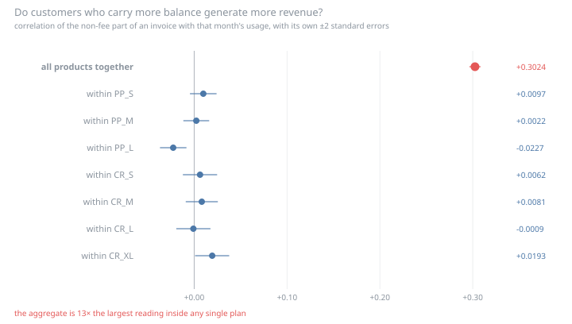
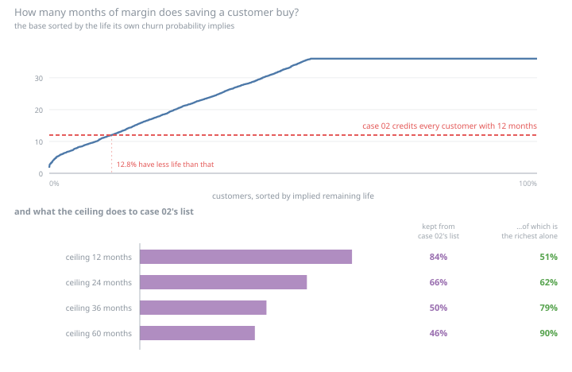
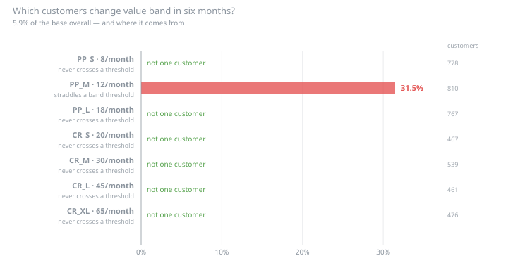
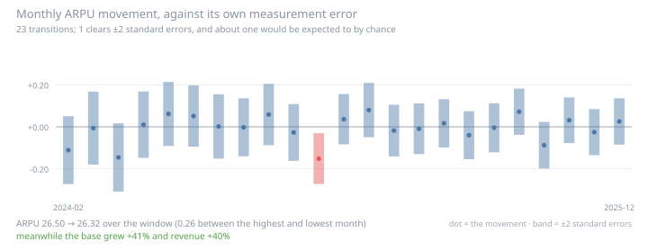

# 04 · ARPU and value decomposition

What is a customer worth? Cases 01, 02, 03 and 05 all had to answer it, and all
of them used the same number: trailing three-month billed revenue, times a flat
margin, times a flat twelve months. This case takes the chain apart and prices
each link.

```
product fee → billed ARPU → collected ARPU → contribution → customer value
```

Each link is changed **on its own**, so its effect is attributable. Changing the
revenue definition, the cost model and the horizon together produces a list that
shares half its names with case 02's and explains nothing about which change did
it — that number is reported too, and labelled as the summary it is.

```bash
uv run run.py                     # writes outputs/report.md and five SVGs
uv run run.py --per-balance 0.32       # re-price at the point where the ranking inverts
uv run run.py --cap-months 12     # case 02's ceiling, applied as a ceiling on life
python run.py                     # stdlib only — no dependencies to install
```

Full results: [`outputs/report.md`](outputs/report.md).

## What it finds

**ARPU is the price list.** 98.03% of the variance in what customers are billed
is between tariffs rather than within them. The rest is the non-fee part of the
invoice — 5.6% of revenue — and the standard question about it produces the
standard mistake.



*Do heavy users generate more revenue?* Aggregated: **+0.3024**, over a hundred
thousand invoice-months, significant by any test anyone would run. Inside a
single tariff, the largest reading in either direction is **−0.0227** — thirteen
times smaller. The product is the confounder: bigger products cost more *and* carry
more balance. Nothing errors, and a pricing team builds a usage-based add-on for a
business that has no usage-based revenue.

Which makes trailing ARPU an estimate of a number that is already known exactly.
The value axis has seven true values; measuring it over three months adds about
**4.7%** of noise to a price that is on the contract.

**The horizon is the whole answer, and it was never argued for.**



Case 02 credited every saved customer with twelve months of margin. The *number*
barely mattered — swapping it for six, sixty or infinity leaves 95–98% of its
target list standing, because the horizon enters that ranking only through the
offer cost. The *flatness* mattered enormously. A 90-day churn probability
already implies a lifetime, and reading it as a constant monthly hazard gives
lives from 1.7 months to the ceiling. Letting the horizon vary per customer moves
**half the target list**.

And then the risk cancels. A save is worth the life it preserves, and the higher
the hazard the less life there is to preserve, so `p` and `1/h` very nearly cancel
— `p/h` measures **2.87** across the base against a label window of 3. Under a
hazard-consistent horizon the expected value of a retention contact barely depends
on churn risk at all, and the target list becomes **79%** the same as ranking by
revenue with no churn model at all.

Which of the two is right depends on a question no dataset here answers: whether
a save *changes* a customer's hazard or merely *postpones one draw* of it. Scoring
each list under each accounting produces a table where every list wins under its
own — that is arithmetic, not evidence: expected realised profit *is* the expected
value the list was sorted by. The answer key cannot break the tie either. It
records what a customer would have done without the campaign inside the same 90
days; what a saved customer does afterwards does not exist, because the world ends
at the cutoff.

**The value axis of case 01 is a constant for most of the base and a coin flip for
one tariff.**



Case 01 found the value axis moves 6.0% in six months against 41.3% for risk, and
concluded value is the slow axis. The aggregate reproduces here — 5.9% — and
every one of those movers belongs to a single tariff, the one whose fee sits on a
band threshold. Six of seven tariffs contribute **not one customer**. An aggregate
of *constant* and *coin flip* reads as *fairly stable*; it is neither, and the
customers in the middle get a different play every quarter for no commercial
reason at all.

**Contribution is owned by a number nobody in the analytics chain has.** The unit
costs live in [`cost_model.csv`](cost_model.csv), not in the scoring script, for
the reason case 03 gave about the contact policy — and one worse: a contact rule
that is wrong gets argued about by the people it blocks, while a marginal cost
that is wrong silently re-orders a customer list and the list looks the same. At
the declared $0.12/1k the contribution ranking and the revenue ranking agree 96%.
The deliverable is not that number, it is where the answer flips: at **$0.15/1k**
the flagship tariff stops being the most profitable one, at **$0.32/1k** it falls
below the cheapest plan on the price list, and at **$0.34/1k** it stops covering
its own cost. All three are inside the range a real operator argues about.

**Two things the case declines to sell**, both in the report at more length: the
collection shortfall does not concentrate in the customers about to leave (it was
the premise, and five folds of the same base span −0.005 to +0.053 — there is no
sign to report), and the ARPU bridge finds nothing, because this data model has no
tariff migration and nobody ever stops being invoiced.



It is kept anyway. One of 23 transitions clears ±2 standard errors, which is about
what pure noise produces, and the deliverable of that section is the interval
rather than the bridge: without one, a monthly review spends forty minutes on a
movement smaller than its own measurement error.

## Layout

```
04-arpu-value/
├── run.py               # CLI entrypoint
├── cost_model.csv       # the unit economics, as reviewable data
├── arpu/
│   ├── data.py          # loading, and which revenue over which customers
│   ├── revenue.py       # the variance split and the usage-link confound
│   ├── bridge.py        # the month-on-month identity, with error bars
│   ├── collection.py    # billed → collected, and the retracted claim
│   ├── costs.py         # the cost model, contribution, and the break-evens
│   ├── horizon.py       # hazard → implied life, and the cancellation
│   ├── decision.py      # four lists from one set of scores
│   ├── stability.py     # case 01's value axis, tariff by tariff
│   ├── charts.py        # hand-written SVG
│   ├── report.py        # outputs/report.md
│   └── pipeline.py      # the case, end to end
└── outputs/             # committed, so a diff shows the analysis changing
```

Tests live in [`../tests/test_arpu_case.py`](../tests/test_arpu_case.py) and run
on the standard library.

## Reuse

The churn model, feature builder, scoreable population and commercial constants
are **case 02's**, imported and refitted rather than quoted — and a test asserts
this case's revenue figure equals case 02's to the last decimal, so the two
cannot drift into disagreeing about what a customer pays. The save rate is the
**12.4%** case 05 measured against its control, not the 25% case 02 assumed. The
band machinery in the value-axis section is **case 01's** own `quantile_cuts` and
`band_of`, so the claim about its axis is made with its own instrument.

This case never opens the answer key. Cases 05, 03 and 01 all consult
`churn_potential_outcomes` through case 05's quarantined module; this one has no
question it could answer, and a test corrupts the table and asserts that not one
number in the result moves.
