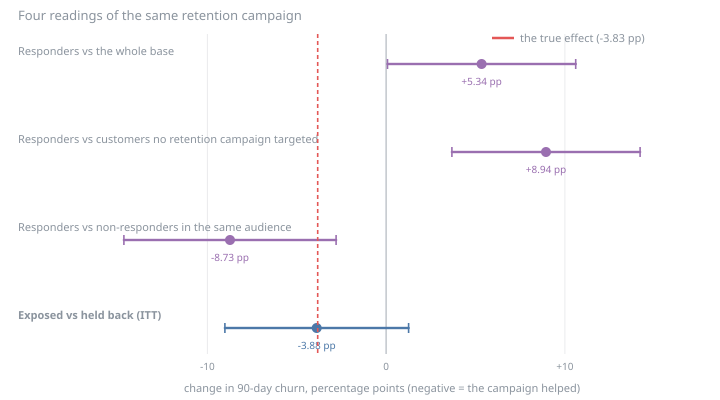
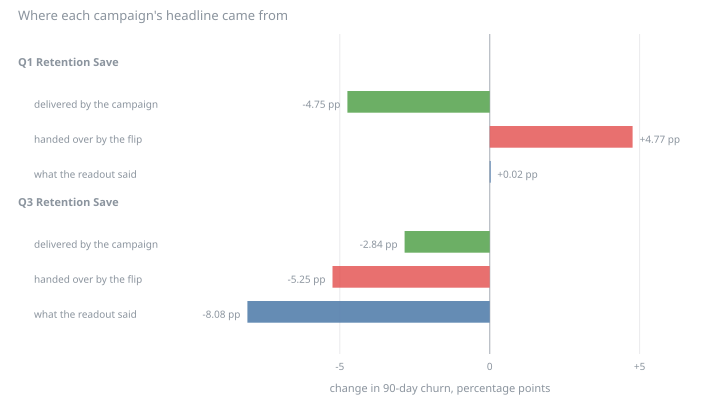
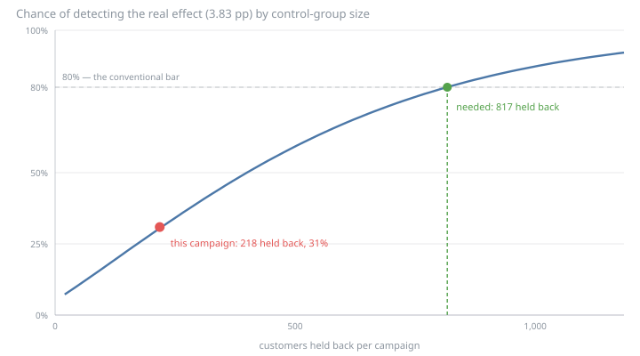

# Campaign incrementality — results

Generated by `uv run run.py`. Every number below is reproducible from the seed;
nothing here is hand-entered. Synthetic data — see `../data-model/DATA_CARD.md`.

## The setup

Two retention campaigns ran against the same base. Both selected their audience the same way — customers the targeting model thought were at risk — and both then **held a share of that audience back**, contacting nobody in it. That held-back group is the only reason any of this is answerable.

| | Contacted | Held back | Accepted the offer | Churn (contacted) | Churn (held back) |
|---|---:|---:|---:|---:|---:|
| Q1 Retention Save (call, 2024-06) | 520 | 218 | 123 | 28.5% | 28.4% |
| Q3 Retention Save (sms, 2025-06) | 511 | 214 | 109 | 26.0% | 34.1% |

The outcome is churn in the 90 days after 2025-12-01 — the same label case 02 predicts. Across both campaigns 1,126 distinct customers were targeted, and 337 of them by both.

## Four readings of the same campaign

The same customers, the same outcome, four ways of asking whether the campaign worked. The first three are available without a control group, which is why they are the ones that get reported.

| Reading | Estimate | 95% interval | What it actually measures |
|---|---:|:---:|---|
| Responders vs the whole base | +5.34 pp | [+0.07, +10.60] | Do customers who took the offer churn less than everybody else? |
| Responders vs customers no retention campaign targeted | +8.94 pp | [+3.68, +14.20] | Do they churn less than the untargeted? |
| Responders vs non-responders in the same audience | -8.73 pp | [-14.67, -2.80] | Do they churn less than others the campaign also chose? |
| **Exposed vs held back (ITT)** | **-3.88 pp** | [-9.02, +1.26] | **What running the campaign did** |

The first two say the campaign made things **worse** — customers who took a retention offer churn 5.34 pp *more* than the base. That is not a campaign failing; it is the targeting working. Retention offers went to people who were already leaving, so any comparison against the untargeted measures who was chosen, not what was done to them.

The third fixes that by comparing inside the audience — responders against the people the same campaign also picked but who ignored it — and the sign flips to a spectacular -8.73 pp. It is still wrong, and more dangerously so, because it looks like it controlled for something. Accepting an offer is a *choice*, and the customers who take one differ from the ones who ignore it in exactly the ways that predict churn.

Only the last row compares groups separated by nothing but a coin flip.

## The same experiment, run twice, disagrees with itself

Both campaigns are the same design on the same population. Read separately:

| Campaign | ITT | 95% interval | Significant? | Smallest effect it could detect |
|---|---:|:---:|:---:|---:|
| CMP_RET_Q1 | +0.02 pp | [-7.11, +7.16] | no | 10.20 pp |
| CMP_RET_Q3 | -8.08 pp | [-15.49, -0.68] | yes | 10.81 pp |
| **Pooled** | **-3.88 pp** | [-9.02, +1.26] | no | 7.34 pp |

One campaign reports **nothing at all** (+0.02 pp). The other reports a large, statistically significant save (-8.08 pp, interval excluding zero). A team holding only the second would launch a programme on it. A team holding only the first would cancel one.

The last column is why they can both be true at once: neither campaign could reliably detect an effect smaller than about 10.20 pp, and nothing this campaign does is anywhere near that big.

## Opening the answer key

The data model records what each customer would have done had the campaign never run — the same customer, the same random draw, one counterfactual flip. That makes an identity available that no real readout has:

> **observed difference = the effect the campaign delivered + the imbalance the coin flip handed over**

| Campaign | Observed | Delivered by the campaign | Handed over by the flip | Luck bigger than effect? |
|---|---:|---:|---:|:---:|
| CMP_RET_Q1 | +0.02 pp | -4.75 pp | +4.77 pp | yes |
| CMP_RET_Q3 | -8.08 pp | -2.84 pp | -5.25 pp | yes |

**Neither headline was about the campaign.** The first campaign delivered -4.75 pp and reported nothing, because the flip happened to hand its contacted group +4.77 pp of extra churn — cancelling the effect almost exactly. The second delivered -2.84 pp and reported -8.08 pp, because its flip ran the other way. In both, the luck was larger than the effect.

Both estimates were nonetheless *correct* — each interval covers its own true value. Unbiased does not mean right on the day: it means right on average over experiments nobody runs twice.

Pooled, the estimate lands at -3.88 pp against a truth of -3.83 pp — a gap of -0.05 pp. **The arithmetic was never the problem.** The pooled number is essentially exact and its interval still runs from -9.02 pp to +1.26 pp, so it cannot rule out the campaign doing nothing whatsoever.

One number explains the whole section: of 5,000 customers, the campaign changed the outcome of **52**. An offer only matters to a customer whose churn sat between the treated and untreated probabilities; everyone else was staying, or leaving, either way. That is what a few percentage points of effect looks like from the inside, and it is why seeing it takes thousands of people rather than hundreds.

## Effect of *contacting* vs effect of the *offer*

The ITT answers what running the campaign did, averaged over an audience most of whom ignored it. Rescaling by how much treatment the contact actually delivered gives the effect on the people who accepted — the complier effect. It is legitimate here because a held-back customer cannot accept an offer they were never sent, so the extra outcomes in the contacted arm have to have arrived through the extra offers taken.

| Quantity | Estimate | 95% interval |
|---|---:|:---:|
| Extra acceptances per contact (first stage) | +20.44 pp | [+16.54, +24.34] |
| Effect per contacted customer (ITT) | -3.88 pp | [-9.02, +1.26] |
| Effect per customer who accepted (CACE) | -18.99 pp | [-44.12, +6.14] |
| *True effect per customer who accepted* | *-24.07 pp* | *known exactly* |

The two effects differ by a factor of about 4.9 — the reciprocal of the response rate. Quoting the second where the first belongs is the most common way a campaign readout inflates itself, and it does not require anyone to lie: both numbers are real, and they answer different questions. **Only the ITT is a return on the campaign**, because the campaign paid to contact everyone, including the majority who ignored it.

The control arm is not untreated, incidentally: 10.1% of the customers held back from the first campaign accepted an offer from the *other* one. Because the two assignments were independent that contaminates nothing — it is balanced across the arms — but it does shrink the gap the effect is spread over, which is precisely what the first stage measures and divides out.

## The falsification test

Two other campaigns ran in the same window — an upsell and a cross-sell. Neither was designed to affect churn, and in the data model neither does. Running them through the identical machinery is the check that the machinery is not manufacturing effects:

| Campaign | Objective | ITT on churn | 95% interval | First stage | Wald estimate |
|---|---|---:|:---:|---:|---:|
| CMP_UP_MID | upsell | +0.92 pp | [-2.33, +4.18] | -0.63 pp | **nonsense — no first stage** |
| CMP_XSELL | crosssell | +2.45 pp | [-0.75, +5.65] | -0.38 pp | **nonsense — no first stage** |

Both intervals cover zero, which is the result the design predicts and therefore evidence the estimator is doing what it claims.

The last column is the trap. These campaigns have **no first stage** — being sent an upsell does not make anyone accept a retention offer — so the denominator of the Wald estimator is noise around zero. Divide by it and the numbers explode: 
- `CMP_UP_MID` reports a complier effect of -146.19 pp — a change in churn larger than churn itself, which is not a quantity that exists — from an ITT of +0.92 pp that is indistinguishable from nothing.
- `CMP_XSELL` reports a complier effect of -646.15 pp — a change in churn larger than churn itself, which is not a quantity that exists — from an ITT of +2.45 pp that is indistinguishable from nothing.

Nothing errors. The ratio is arithmetically correct and completely meaningless, and it is meaningless in the direction that flatters the campaign. **The guard is the first stage, checked before the ratio is taken, not after it is presented.**

## What the diagnostic you *can* run would have told you

The decomposition above needs the answer key. The balance check does not: it compares the two arms on everything that was already true before the campaign ran, which — if the flip was fair — should look alike. Covariates are case 02's feature set, built as of the month before each campaign, so nothing the campaign could have changed is in them.

| Campaign | Covariates | Beyond two standard errors | Beyond the 0.10 convention | Expected by chance | Verdict |
|---|---:|---:|---:|---:|---|
| CMP_RET_Q1 | 17 | 4 | 6 | 3.7 | more imbalance than chance predicts — treat the estimate with suspicion |
| CMP_RET_Q3 | 19 | 1 | 4 | 4.2 | consistent with a fair flip (about as many as chance predicts) |

It half-works, and the half that fails is the dangerous half. The first campaign — the one whose flip cancelled its effect — is flagged: 4 covariates sit beyond two standard errors where chance predicts about one. The second campaign passes cleanly with 1, and its headline overstates the truth by a factor of 2.8.

**So the balance table blessed the misleading result and questioned the honest one.** It is worth running — it is nearly free and it is the only such check available — but it detects broken randomisation, not insufficient randomisation, and those fail differently. An imbalance large enough to swamp a three-point effect is small enough to look ordinary.

The largest imbalances in the flagged campaign, for the record:

| Covariate | Contacted | Held back | Standardised difference |
|---|---:|---:|---:|
| `tickets_last6` | 0.512 | 0.679 | -0.194 |
| `active_days_last3` | 20.005 | 21.787 | -0.189 |
| `monthly_fee` | 24.965 | 22.000 | +0.177 |
| `tenure_months` | 3.842 | 4.161 | -0.171 |

*(The table also drops covariates that were constant before the campaign — 2 more of them for the earlier campaign, `retention_offer_taken` among them: it ran before any retention offer existed to have been taken, so the column is constant. A covariate with no variance cannot be imbalanced, and padding the table with rows that can never fail would make every experiment look better balanced than it is.)*

## A population rule that is right for prediction and wrong here

Case 02 excludes customers who churned in the earlier window before scoring anything, and it is right to: a model should not be judged on people who have already gone. Carrying the same filter into this analysis is a different act, because **the campaign changed who ends up in the filter**.

| Campaign | ITT on the randomised audience | After excluding earlier churners | Shift | Extra share of the held-back arm removed |
|---|---:|---:|---:|---:|
| CMP_RET_Q1 | +0.02 pp | -0.88 pp | -0.90 pp | +2.20 pp |
| CMP_RET_Q3 | -8.08 pp | -2.61 pp | +5.47 pp | +3.39 pp |

The filter removes more of the held-back arm than the contacted one, in both campaigns — because the campaign worked, so fewer treated customers had churned earlier to be filtered out. The two groups that survive are no longer the two groups that were randomised, and the headline moves by up to +5.47 pp: more than the entire effect being measured.

Whether it moves toward the truth or away from it is luck. The rule is not *this filter is bad* — it is that a causal estimate is defined on the population that was randomised, and every filter applied after the flip has to be justified against that, no matter how sensible it was upstream.

## Where does the effect live?

The natural next question, and the one that sells uplift modelling: if the effect is concentrated somewhere, target there. Each audience is split into thirds by a churn score fitted **on untreated customers only** — fitting it on everyone would learn part of the treatment effect and then be used to locate the treatment effect.

**CMP_RET_Q1**

| Stratum | Contacted | Held back | Mean predicted risk | Estimated effect | 95% interval | True effect | True effect on those who accepted |
|---|---:|---:|---:|---:|:---:|---:|---:|
| lowest risk | 183 | 63 | 9.9% | +1.77 pp | [-9.91, +13.45] | -2.89 pp | -25.00 pp |
| middle | 181 | 65 | 15.0% | +3.01 pp | [-9.32, +15.34] | -4.11 pp | -26.32 pp |
| highest risk | 156 | 90 | 25.4% | -0.13 pp | [-12.63, +12.37] | -6.58 pp | -24.53 pp |

**CMP_RET_Q3**

| Stratum | Contacted | Held back | Mean predicted risk | Estimated effect | 95% interval | True effect | True effect on those who accepted |
|---|---:|---:|---:|---:|:---:|---:|---:|
| lowest risk | 175 | 66 | 10.6% | -5.96 pp | [-17.78, +5.86] | -5.34 pp | -25.00 pp |
| middle | 165 | 77 | 19.8% | -8.23 pp | [-20.56, +4.11] | -2.16 pp | -28.26 pp |
| highest risk | 171 | 71 | 40.7% | -9.40 pp | [-23.02, +4.22] | -1.14 pp | -27.14 pp |

Two findings, and the second is the one that matters.

**The experiment cannot resolve any of this.** The widest stratum interval spans 27 percentage points against an estimated spread between the extreme strata of -1.90 pp and -3.44 pp. Splitting an underpowered experiment into three makes three underpowered experiments. Every stratum interval covers every other stratum's estimate, so the ordering — which looks tidy and monotone in the second campaign — carries no information.

**And there is nothing to find.** The last column is a population quantity rather than a sample one, and it is flat: an accepted offer is worth about 26.04 pp of churn probability in every stratum of both campaigns. What moves a stratum's ITT is how many of its members happened to accept — which runs one way in the first campaign and the other way in the second, the signature of noise rather than structure.

So there is no uplift-based targeting rule here, and an experiment this size could not have found one if there were. That is a narrower conclusion than case 02's — where re-sorting the same probabilities by expected value moved profit by two thirds — and the difference is instructive: **ranking who to call is a modelling problem and this data supports it; ranking by measured incremental effect is a measurement problem and this data does not.**

## Paying off case 02

Case 02 priced its contact list with a **save rate of 25.0%** — the share of would-be churners a contact retains — and said plainly that the number was assumed, that no observational data could establish it, and that this case was where it would be settled. The experiment measures it directly:

    save rate = −ITT ÷ churn rate in the held-back arm

| | Value |
|---|---:|
| Churn among the held back (would-be churners per contact) | 31.2% |
| Incremental saves per contact | 3.88 pp of churn prevented |
| **Measured save rate** | **12.4%** |
| 95% interval | -4.0% to 28.9% |
| Assumed by case 02 | 25.0% |
| *True value* | *11.1%* |

Two statements are both true, and only one of them is knowable without the answer key.

The experiment **cannot reject case 02's assumption**: 25.0% sits inside the interval. It cannot reject zero either — the interval runs from -4.0% to 28.9%, which spans *the campaign does nothing* and *the campaign is better than case 02 assumed*. On the evidence, case 02's number survives.

And case 02's number was **wrong by a factor of 2.3** — the truth is 11.1%. The measurement was closer (12.4%), which is not a vindication of the measurement so much as a coincidence at this sample size.

That is the useful finding for a retention team, and it is not a save rate. It is that **the experiment as designed cannot tell them whether their planning assumption is right, wrong, or describing a campaign that does nothing.** The fix is not a better estimator. It is a bigger held-back group.

### What that does to case 02's decision

Case 02's contact list, re-priced at each save rate. The model, the probabilities and the budget are identical — only the assumption moves.

| Save rate | | Profit, ranked by risk | Profit, ranked by expected value | Difference | Best capacity |
|---|---:|---:|---:|---:|---:|
| assumed by case 02 | 25.0% | 2,772 | 4,595 | +1,824 | 2,188 |
| measured | 12.4% | 1,047 | 1,953 | +906 | 1,312 |
| low end of the interval | 0.0% | -656 | -656 | +0 | 0 |
| high end of the interval | 28.9% | 3,301 | 5,407 | +2,105 | 2,188 |

Case 02's headline — that re-sorting the same probabilities by expected value is worth +1,824 at a fixed budget — **survives**, at +906. The ranking never depended on the save rate: it is a positive constant common to every customer's expected value, so it cannot reorder anybody. What it changes is the *level*, and therefore how many people are worth calling at all — the optimal capacity moves from 2,188 contacts to 1,312.

That is the honest summary of the damage: case 02's *decision* was robust to the assumption it flagged, and its *business case* was not.

## How big the held-back group needed to be

| | Value |
|---|---:|
| Effect actually there | -3.83 pp |
| Held back, per campaign | 218 and 214 |
| Chance CMP_RET_Q1 alone called it significant | 18.3% |
| Chance CMP_RET_Q3 alone called it significant | 17.3% |
| Chance the two pooled did | 30.9% |
| Held back needed per campaign, for an 80% chance | 817 |

The design had roughly an 18.3% chance of finding what was there — so about four campaigns in five come back empty. Two ran here and one came back significant, which is already better luck than the design deserved. The answer key adds the detail that makes the point: **the campaign that reached significance was the one that delivered less.**

Pooling both helped and was not enough: 30.9%, still short of the 80% bar and still an interval covering zero. Reaching it needs about 817 customers held back per campaign — against the 218 actually held back, close to 4× more. A sample-size calculator asked for one balanced experiment would say 2,301 per arm — the gap is not a discount, it is bookkeeping: 817 counts customers *held back*, across two campaigns, each of which also contacts 2.4 people for every one it holds back.

Two things worth separating, because the instinct is to fix the wrong one. Raising the held-back share from 29.5% to half would shrink the interval by under a tenth: the binding constraint is the **audience**, not the split. Measuring the outcome in a window right after the campaign rather than months later would help more. Pooling campaigns deliberately — as a standing measurement programme rather than two separate readouts — would help most, and costs nothing that is not already being spent.

## Limitations

- **The outcome is measured long after the campaign.** The data model carries one labelled window, so the effect of a campaign in 2024-06 is read against churn 2025-12 onward. The generator's effect is permanent, so nothing decays here; in a real operation it would, and measuring that far out would understate a campaign that worked.
- **The two pooled estimates share customers.** 337 of 1,126 targeted customers were in both audiences, so the two ITTs are not independent and the pooled interval is slightly narrower than it should be. It does not change the verdict — the interval covers zero comfortably either way — but a customer-level clustered analysis would be the correct treatment.
- **Pooling across campaigns has a trap this case sidesteps rather than solves.** Treating "exposed to either campaign" as one arm would break the randomisation, because being in two audiences is itself a marker of risk. Each campaign is therefore estimated separately and combined by precision, which is valid; a stratified analysis by targeting pattern would use the overlap rather than working around it.
- **One draw of one world.** Every conclusion about luck here rests on the two randomisations that happened. Re-running the generator across many seeds would turn "the imbalance exceeded the effect" from an observation into a distribution.
- **Synthetic data with a known generating process.** That is what makes the answer key possible, and it also means the estimator is never tested against what breaks real experiments: crossovers, spillovers between customers, contact-policy overrides, audiences rebuilt mid-flight.
- **Consent and eligibility are not enforced here.** The audiences are taken as the campaign built them. Case 03 has to confront who was *allowed* to be contacted.

## What would make this good enough to run on

Stated as design rules, not aspirations:

- Every retention campaign holds back a control group sized from a **stated minimum detectable effect**, not from a habit. At this base rate and a 3.83 pp target, that is about 817 held back per campaign.
- The readout reports the ITT, the first stage and the interval together. A complier effect is published only when the first stage is strong, and never as the campaign's return.
- Results accumulate across campaigns by design, so the programme answers a question no single campaign is large enough to answer.
- A campaign with no plausible mechanism on the outcome is run through the same pipeline every cycle as a falsification test. When it starts reporting effects, the pipeline is broken.
- Filters applied after randomisation are justified against the randomised population, or dropped.
- The save rate in the planning model is dated, carries its interval, and is refreshed from the accumulated experiments rather than inherited.

