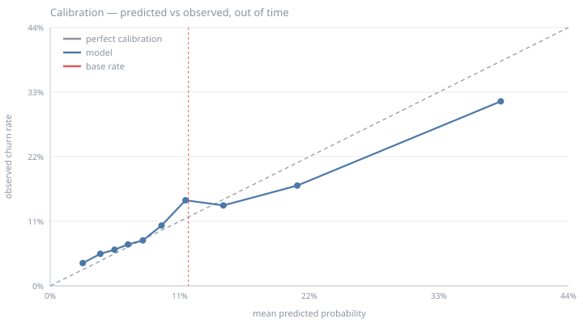
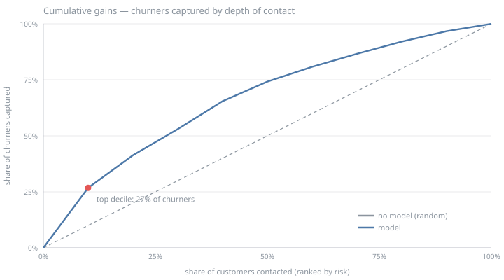
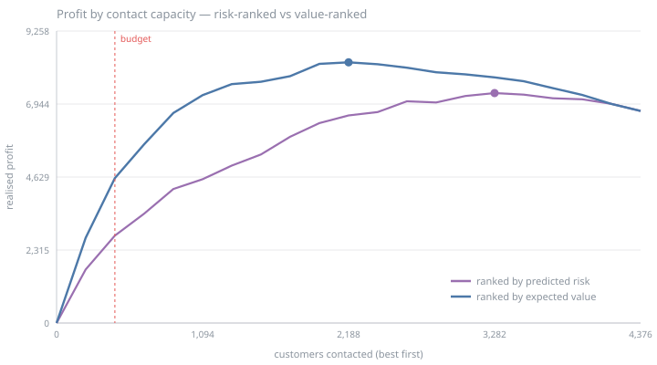

# 02 · Churn without leakage

**The decision this serves:** a retention team can call a few hundred customers
this month. Which ones, and is calling them worth the money?

Not "can we predict churn". Prediction is the easy half, and the half that
flatters itself — a churn model that scores beautifully and changes nobody's
call list has produced nothing. So this case is built around the two places
churn work actually fails: **evaluation that cannot see the future**, and a
**score nobody can act on**.

```bash
uv run run.py          # generates the data, trains, evaluates, writes outputs/
python run.py          # identical — standard library only, no dependencies
```

Full numbers, charts and reasoning: **[`outputs/report.md`](outputs/report.md)**.

## What it does

Trains on the world as it looked at one observation cutoff and scores the world
six months later — an out-of-time backtest, the way a deployed model is judged.
Then it deliberately reruns the same model two dishonest ways, to show what each
shortcut would have reported.

| Reading | AUC | What it measures |
|---|---|---|
| **Out of time** — fit 2025-06, scored 2025-12 | **0.690 ± 0.014** | Whether it generalises *forward* |
| In-time random split | 0.709 | Whether it generalises to unseen *customers*, in the period it was fitted on |
| With one post-outcome feature | 1.000 | Nothing at all |

The third row is the point. Adding one field derived from the label takes AUC to
1.000. Nothing errors, no test fails, and the model is worthless. **Leakage does
not announce itself — it shows up as a result good enough that nobody questions
it.**

The first two rows are the point in a quieter way. The gap is +0.020 against a
standard error of ±0.014, so *this dataset does not prove the random split is
optimistic*. The report says so explicitly rather than banking a convenient
number. The reason to evaluate out of time is methodological: a random split
cannot detect drift, seasonality or a population that changed shape, because it
holds none of them out.

## How leakage is prevented, not just avoided

Every fact passes through one function that drops anything dated after the
cutoff — [`features._before`](churn/features.py). That is the whole guarantee,
in one place, so it can be read in ten seconds and tested directly.

The test that matters poisons the input tables with facts dated `2099-01-01` and
rebuilds the feature matrix. If a single number moves, something read the
future.

Three quieter leaks are closed the same way:

- **The transforms are fitted objects, not steps.** The standardiser, the
  collinearity filter and the calibrator are bundled with the model
  ([`FittedModel`](churn/pipeline.py)) precisely because re-deriving any of them
  from the scoring data is leakage that nothing would flag.
- **Calibration is fitted on data withheld from training** — never on the set
  its calibration is then reported against.
- **The scoring population excludes customers who churned in the earlier
  window.** They left. Scoring a model on customers who are already gone
  measures nothing, and it is the population error that no metric catches.

## Calibration is where the time gap actually shows



The ranking survives six months. The *level* does not: calibration slope 0.77,
so the model is overconfident. Recalibrating on the training period does not fix
it, because the base rate moved after the calibrator was fitted.

That separation matters operationally. Ranking is all a prioritised call list
needs — and it is fine. Any decision involving money needs the level, and that
has drifted. So the answer is not a better model: it is recalibration against
the most recent closed window, and a drift alarm on predicted-vs-actual base
rate.



## Drivers: what the model says, and what it means

Coefficients are reported **twice** — marginal (the effect alone) and
conditional (given every other feature) — because they answer different
questions and quoting the second as if it were the first is how an explainable
model gets explained wrong.

Because this dataset's causal structure is *known*, the check is real rather
than a matter of taste: of the 9 designed drivers, **5 recovered** with the
correct sign, **0 contradicted**, 4 too weak to read individually — their
marginal effect is smaller than its own standard error, and reporting the sign
of a coefficient smaller than its noise would be the analytical error, not the
finding.

Two things this section is honest about:

**Three features were dropped before the coefficients were read**, each a
near-duplicate of one already kept (`arpu_last3` and `monthly_fee` correlate
0.997). Not for accuracy — the ridge penalty absorbs collinearity and AUC barely
moves. Fitted unpruned, the model reports that *an unresolved escalation reduces
churn*, the exact opposite of how the data was built. **A model whose
explanation is wrong is worse than one with no explanation, because someone will
act on it.**

**`retention_offer_taken` looks inert on its own (−0.045) and strongly
protective conditional on risk (−0.290).** That is confounding, and it is in the
data on purpose: retention campaigns were targeted at high-risk customers.
Untangling it properly needs the held-out control group — case 05, not this one.
Here it stands as a warning: that coefficient is not a campaign ROI.

## The part that decides whether any of it mattered



Same model, same probabilities, same budget of 437 contacts. Only the sort order
changes:

| Targeting | Realised profit |
|---|---:|
| Ranked by predicted risk | 2,772 |
| Ranked by expected value | 4,595 |
| **Difference** | **+1,824** |

The two lists share just **44%** of their names. Ranking by risk promotes
customers who are likely to leave but cheap to lose, and a contact spent there
is a contact not spent on someone worth keeping. The curves also peak in
different places: risk-ranked peaks at 3,282 contacts, value-ranked at 2,188 —
**more profit from fewer calls.**

This is why "accuracy alone isn't success" is a claim about the *deliverable*,
not about the metric. Accuracy is not reported anywhere in this case. At an
11.8% base rate, predicting "nobody churns" scores 88.2% and is worth nothing.

## Limitations

- **The save rate is assumed, not measured.** Whether a contact *caused* a save
  is unknowable without a control group — case 05. Until then these figures are
  a planning model, not a measured return.
- **One historical split** gives a point estimate, not a distribution. A rolling
  backtest over several cutoffs would put an error bar on the AUC gap.
- **Synthetic data with a known generating process.** That is what makes the
  driver check possible, and it also means the model is never tested against
  what breaks real pipelines: missing history, merged accounts, plan migrations,
  delayed billing.
- **Consent is static** in the data model and is not used here. Case 03 has to
  confront it.
- **A 90-day window is a choice**, and nothing here establishes it is the right
  one for a given retention operation.

## Layout

```
02-churn-prediction/
├── run.py              # CLI: train, evaluate, write outputs/
├── churn/
│   ├── data.py         # loading, and defining who is scoreable at a cutoff
│   ├── features.py     # features as of a cutoff — the no-leakage boundary
│   ├── model.py        # standardiser, collinearity filter, IRLS logistic, Platt
│   ├── metrics.py      # ranking, calibration and concentration — never one number
│   ├── economics.py    # expected value per contact, targeting policies
│   ├── charts.py       # SVG, hand-written, deterministic
│   ├── report.py       # the markdown in outputs/
│   └── pipeline.py     # the case end to end, and the two shortcuts
└── outputs/            # committed, so the result is visible without running it
```

Tests live in [`../tests/test_churn_case.py`](../tests/test_churn_case.py) and
run on the standard library, so CI validates the leakage boundary, the
train-only transforms and the metric arithmetic on every push.

**Why no pandas or scikit-learn.** The estimator here is a ridge-penalised
logistic regression fitted by IRLS — 60 lines, and the right default for a
decision that has to be defended to a retention team. Writing it out keeps every
number in the report auditable, keeps the result reproducible years from now
(no library version can silently change it), and lets CI run the whole thing
without installing anything. The hard part of this case was never the estimator.
