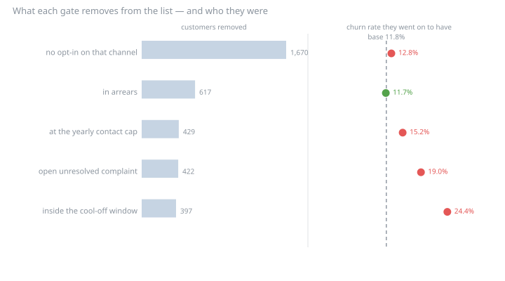
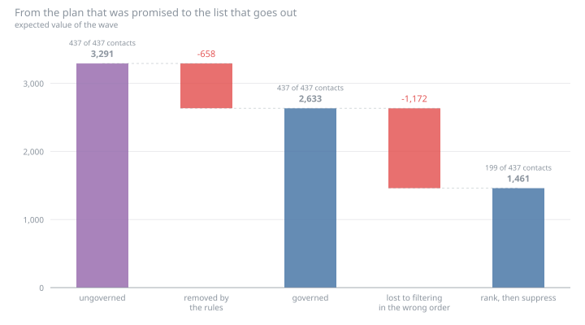
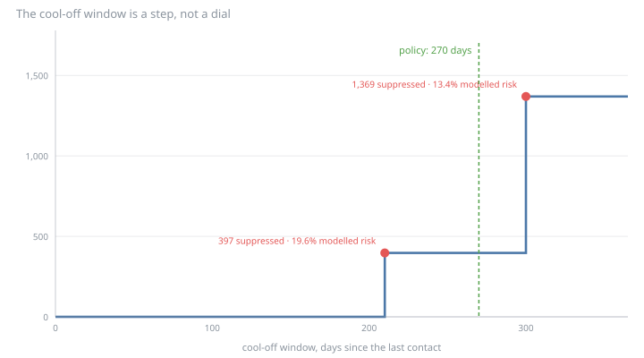

# 03 · Governed next-best-offer

**The decision this serves:** there is capacity to contact 10% of the base next
month, a catalogue of offers, and a model that ranks customers. Who gets
contacted, with what?

Cases 02 and 05 both took their audiences **as the campaign had built them**.
This case asks the question they skipped — who was the company *allowed* to
contact — and finds that the answer changes more than the ranking does.

```bash
uv run run.py          # generates the data, decides, writes outputs/
python run.py          # identical — standard library only, no dependencies
```

Full numbers, charts and reasoning: **[`outputs/report.md`](outputs/report.md)**.

## The finding

Not that governance costs volume — everyone expects that. It is that **the gates
do not remove a random slice**: the group each one takes out went on to churn at
anywhere from 11.7% to 24.4%, against a base of 11.8%. The permitted population
is a different population, not just a smaller one.



| Rule | Customers removed | Their actual churn |
|---|---:|---:|
| no opt-in on that channel | 1,670 | 12.8% |
| in arrears | 617 | 11.7% |
| at the yearly contact cap | 429 | 15.2% |
| open unresolved complaint | 422 | 19.0% |
| **inside the cool-off window** | **397** | **24.4%** |

The wave's own churn rate is 11.8%. The most selective thing in the policy is
the **cool-off window** — a rule nobody thinks of as targeting. Its mechanism is
circular: those customers were contacted last quarter *because* they were high
risk, and they are barred this quarter for having been contacted.

Two eligibility rules block 7,255 customer-offer pairs and remove **nobody**:
the offers they refuse were never anyone's best offer. That is why "pairs
blocked" is a useless way to price a rule, and the report gives three counts
rather than one.

## The order you apply the rules in costs more than the rules



| List | Contacts | Expected value | Actual churn of those contacted |
|---|---:|---:|---:|
| ungoverned — what the plan promised | 437 | 3,291 | 14.9% |
| **governed — filter, then rank** | **437** | **2,633** | **8.9%** |
| rank, then suppress | 199 | 1,461 | 8.5% |

Governance costs **658** of expected value. Doing the *same* governance in the
wrong order costs **1,172 more** — 1.8× the rules themselves — because ranking
first and suppressing afterwards leaves the freed capacity unfilled: 199
contacts against a capacity of 437. Nothing errors, both lists are equally
compliant, and the campaign reports that it contacted the top of the list.

The last column is the part that is not about money. The rules do not scale the
programme down; they point it somewhere else. Only 49.4% of the governed list
appears in the ungoverned one.

## The cool-off window is a step, not a dial



At 180 days it suppresses nobody. At 210 it suppresses 397 customers at 19.6%
modelled risk — a whole retention audience arriving in one lump. Widen it
further and the suppressed group *grows and gets safer*, because the window
starts reaching campaigns that were never targeted on risk.

The cost of this rule is not a trade-off anyone tuned. It depends on where the
edge falls relative to a campaign calendar nobody consulted when the number was
written down.

## What compliance would have cost the campaigns that already ran

The forward-looking list is scored in expectation — whether a customer would
accept an offer they were never sent is not observable. But the retention
campaigns in the data model *did* run, and the model records what every customer
would have done had they not. So one question is answerable exactly:


| Campaign | Contacted | Allowed | Saved | Saved if compliant |
|---|---:|---:|---:|---:|
| Q1 Retention Save (call) | 520 | 165 | 39 | **9** |
| Q3 Retention Save (sms) | 511 | 286 | 36 | 25 |

Q1 went out by **call** — the channel with the lowest opt-in in the base — so
68.3% of the people it contacted had never agreed to be contacted that way.
Restricted to those it was allowed to contact, it would have changed the outcome
for 9 customers instead of 39.

The loss splits exactly in two, and the split matters because the two halves
have different remedies:

> saves(compliant) − saves(as run) = **volume** + **composition**

Volume accounts for −42.5 customers across both campaigns; composition, +1.5 —
and in neither campaign is the composition term resolvable from noise, with the
two campaigns disagreeing about even its sign. **Compliance is a reach problem,
not a targeting problem**, and the story a retention team reaches for — *"but
the people who opted in are better customers"* — is not supported here.

Reach on `call` is 36.0%; on the best-consented channel, 61.5%. Delivering the
same offer where the customer agreed to hear it needs no new assumption about
effectiveness to move the term that dominates.

## Two traps it demonstrates rather than describes

- **The offer nobody has ever sent wins the auction.** The catalogue has five
  offers; one has never been in a campaign, so there is no response history
  behind it. Score it anyway — with the model fitted on the offer that *did*
  run, which is what an engine does by default — and it takes **320 of the 437
  slots** and reports a **74% higher** expected value, made entirely of an
  assumption. There is no variation in the data from which its price
  sensitivity could be estimated, so nothing corrects it: the offer with the
  least evidence gets the most confident number.
- **A campaign can be fully consented and still absurd.** The upsell campaign
  passed on consent for 64% of its audience and offered *Upgrade to M* to
  customers of whom only **22%** were on a plan the offer would improve. The
  rest were sent an upgrade to the plan they already had, or to a worse one.
  That is not a compliance breach; it is a broken product rule, and it costs
  response rather than fines — which is why eligibility is modelled separately
  from contact policy here.

## What it takes from the other cases

- **Case 02** supplies the churn model, its feature builder and the base
  `Economics`, refitted here rather than quoted, so the risk score behind every
  offer cannot drift from the case that published it.
- **Case 05** supplies the save rate — the measured **12.4%**, not the assumed
  25% — and the quarantined module that reads the answer key. This case never
  opens `churn_potential_outcomes` itself; it imports case 05's `truth.py`, so
  exactly one file in the track touches that table.

It also extends the shared data model twice: a new reference table
`contact_policy` (the rules, as data) and a new column `upgrade_to_rank` on
`offers`. Neither consumes randomness, so **thirteen of the fourteen
pre-existing tables are byte-for-byte identical** to a run without them — the
fourteenth being `offers`, which gained the column.

## Limitations

- **Consent has no effective date**, so the retrospective audit judges past
  campaigns against today's opt-ins. In a real audit, consent-as-of-the-send-date
  is the only defensible version, and its absence would be the first finding.
- **The forward-looking list is a plan, not a result.** No control group was
  held back from it — the position case 02 was in before case 05 ran.
- **An offer's effect is assumed to be channel-independent.** Moving an offer
  from `call` to `push` changes reach, which is measured here, and probably
  changes response, which cannot be: no campaign ran the same offer on two
  channels.
- **One draw of one world.** The step in the cool-off curve sits where it does
  because of one campaign calendar.

## Layout

```
03-next-best-offer/
├── run.py                  # CLI: decide, write outputs/
├── nbo/
│   ├── data.py             # the wave, the plan ladder, the offer catalogue, contact history
│   ├── policy.py           # the rule engine — every refusal attributed to a rule
│   ├── value.py            # expected value per customer x offer; the acceptance model
│   ├── allocation.py       # capacity, and the three ways to assemble a list
│   ├── audit.py            # the retrospective check, through case 05's answer key
│   ├── charts.py           # SVG, hand-written, deterministic
│   ├── report.py           # the markdown in outputs/
│   └── pipeline.py         # the case end to end
└── outputs/                # committed, so the result is visible without running it
```

Tests live in [`../tests/test_nbo_case.py`](../tests/test_nbo_case.py). Two carry
their weight: one corrupts the answer key and asserts that **every decision is
unmoved while the audit moves** — a case that peeked would report better numbers,
so no assertion on a result could catch it — and one changes a row in
`contact_policy` and asserts the outcome changes, which is the only test a
hardcoded policy would fail.
