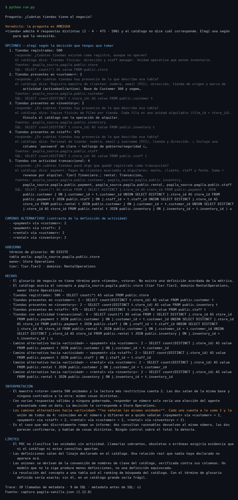

# Metric ambiguity — an agent that offers definitions instead of inventing one

**The problem in one sentence:** a data agent that turns a business question
into SQL before establishing what the question means will answer confidently
and specifically, and there is no way to tell from the answer that it picked
one of several possible meanings.

> **Maturity: `POC`.** One vertical slice, built to demonstrate one behaviour.
> Not a product, not deployed, not a UI. Everything it touches is public
> synthetic data.
>
> The agent's own output is in Spanish, like the two sibling projects in this
> track; the documentation is in English, like the rest of the repository.

<p align="center">
  
</p>

## Why the question is ambiguous

Ask the Pagila video-rental database **"how many stores does the business
have?"** and every one of these answers is correct:

| Reading | Source | Answer |
|---|---|---:|
| Stores on the register | `store` | **500** |
| Stores with staff assigned | `staff.store_id` | **475** |
| Stores with customers | `customer.store_id` | **2** |
| Stores with inventory | `inventory.store_id` | **2** |
| Stores with transactional activity | `payment`/`rental` through their bridges | **4** |

Nothing in the catalogue says which one is *the* number, because the business
glossary has **no term for "store"**. It carries 23 terms across two
glossaries — `Film`, `Inventory`, `Rental`, `Payment`, `RentalRate`,
`RentalRevenue`, a governance vocabulary — and not the one the question is
about.

That absence is the finding, and it is what the catalogue actually contributes
here. It does not hand over the answer; it proves the metric is **ungoverned**,
names who should govern it (`Store Operations`, tier `Tier.Tier2`, domain
`RentalOperations`), and — through its lineage edges — points at exactly which
tables carry a `store_id` worth interrogating. The SQL is *derived from the
catalogue*, not guessed.

### The 498 stores are not a defect

The tempting conclusion is that 498 of those stores are junk. There is no
evidence for it, and evidence to the contrary: upstream
[`devrimgunduz/pagila`](https://github.com/devrimgunduz/pagila) ships `store`
with 500 rows and `staff` with 1 500, while `customer` and `inventory`
reference only stores 1 and 2 — **in the current upstream too**. The master
tables were scaled up and the transactional tables never followed. It is a
property of the public dataset, not a business problem, and the POC says so
instead of editorializing.

### The finding that is worse than 500-vs-2

Four different, equally reasonable ways to ask "which stores have transactional
activity?" each return **2**. They do not agree on *which* two:

```
payment via customer  -> {1, 2}
rental  via customer  -> {1, 2}
rental  via inventory -> {1, 2}
payment via staff     -> {25, 33}     <-- disjoint from the rest
```

The two employees who process all 16 049 payments belong to stores 25 and 33,
which have zero customers and zero inventory. So two analysts can write two
sensible queries, both get "2", both feel corroborated, and be talking about
entirely different stores. **No check on the total detects this** — the totals
match.

The POC catches it by computing the union across all lineage-derived paths
(4 ≠ 2) rather than comparing counts. That distinction is not academic: the
first version of this code compared counts and reported "the paths agree".

## What the POC does

1. Asks the glossary whether the term is already defined. It is not.
2. Resolves which table represents the concept — **not** by taking the top
   search hit (searching "tienda" also returns `staff` and `inventory`), but
   structurally: the anchor is the table whose key the other candidates
   reference.
3. Walks the lineage one and two hops out, reading each neighbour's columns.
4. Derives one reading per table that carries the anchor key, plus one union
   reading across the two-hop transactional paths.
5. Only then opens the SQL phase and counts.
6. Returns the readings with their value, their SQL, their FQNs, what the
   catalogue says each source table means, and which business question each one
   answers — then asks the user to choose.

**Nothing in step 4 is hardcoded.** Change the catalogue and the readings
change; four tests amputate it (remove a column, remove a lineage edge) and
require the output to change accordingly. Hardcoded queries would pass every
value test and fail those.

## Metadata before SQL is structural, not a prompt

The usual way to make an agent consult the catalogue first is to tell it to.
That is an instruction, and instructions can be disobeyed — a trace would then
faithfully record the violation.

Here the SQL tool refuses to exist until the trace has recorded a metadata
call:

```python
tools.scalar("SELECT count(*) FROM public.store")
# PhaseViolation: la herramienta de SQL está cerrada hasta que se consulte el catálogo
```

`open_sql_phase()` itself refuses if no metadata call has happened. So there is
no possible run in the other order, and a test asserts it rather than a trace
observing it once.

## Read-only in three layers

The sibling project's guard (`agent-data-analyst/sql_server.py`) enumerates
forbidden words and tokenises with `split()`. Measured against 12 cases, **it
lets 8 through** — `SELECT 1;DROP TABLE store` passes because the token is
`1;DROP`. Enumerating what is forbidden means guessing every way to write it.

This POC inverts the test and stacks three independent layers:

| Layer | Mechanism | Survives if the others fail |
|---|---|---|
| 1 | One statement, must start with `SELECT`/`WITH`, literals and comments neutralised first | — |
| 2 | `READ ONLY` transaction: the *engine* refuses | yes |
| 3 | Role with no write grants: nothing to exercise | yes |

`verify_readonly.py` proves layers 2 and 3 by **bypassing layer 1 on purpose**
— the only way to show they hold alone:

```
CREATE TEMP TABLE poc_intento (x int)  -> cannot execute CREATE TABLE in a read-only transaction
DELETE FROM public.store WHERE false   -> cannot execute DELETE in a read-only transaction
privileges of the role on public.store -> SELECT yes · INSERT/UPDATE/DELETE/TRUNCATE no
```

Full output: [`evidencia/verificacion-readonly.txt`](evidencia/verificacion-readonly.txt).

## Deterministic or model-driven? Measured, not argued

Both variants run on the same tools, the same guard, the same gate and the same
trace recorder, so what is compared is behaviour. The model gets a good-faith
prompt that states the expected order explicitly. Criteria were fixed before
looking at results.

```
$ python compare.py --runs 3        # model: kimi-k2.6

variante        orden ok  lecturas  halló staff  cifras que no recomprueban  idénticas
deterministica  3/3       5         3/3          0                           sí
llm             3/3       3,4       1/3          0                           no (3 distintas)
```

The model **respected the order in all three runs** — the gate and the prompt
work — and every figure it reported re-checked against the source. It loses on
coverage and stability: it found the `staff` reading once in three, so **two of
three runs produce exactly the misleading 500-vs-2 binary**, which reads as a
typo rather than an ambiguity. None of the three found the disjoint-paths
problem.

One constraint worth recording: the current Kimi models reject `temperature: 0`
(`invalid temperature: only 1 is allowed for this model`). Without greedy
decoding, identical runs are not achievable even in principle, so this
variant's reproducibility has a ceiling the prompt cannot raise.

Detail: [`evidencia/comparacion.json`](evidencia/comparacion.json).

## Architecture

```
run.py ── deterministic orchestrator ──┐
      └─ LLM orchestrator (optional) ──┤
                                       ▼
                                  GatedTools ──── records every call ──▶ tracing.py
                                   │      │       (successes AND failures)
                    metadata ──────┘      └────── sql (closed until metadata)
                         │                              │
                    om_client.py                    pg_client.py
                    read-only REST                  READ ONLY txn + timeout
                         │                              │
                  OpenMetadata 1.12.8              PostgreSQL (Pagila)
```

The core — guard, derivation, orchestration, report — is **standard library
only**, because CI runs `uvx pytest` in an ephemeral environment with none of
the project's dependencies installed. `httpx` and `psycopg2` live behind
adapters that are imported lazily, on the live path only.

`mcp_server.py` publishes the same read-only tools over MCP, for continuity
with the two sibling projects in this track. The POC's own run does not go
through it: an extra process buys no evidence and costs CI fragility.

## Running it

Offline, against the committed capture of a real run — no services, no
credentials, no network:

```bash
python run.py
```

Against live services:

```bash
cp .env.example .env      # fill in; never commit real values
uv run --with httpx --with psycopg2-binary python run.py --live
uv run --with psycopg2-binary python verify_readonly.py
uv run --with httpx --with psycopg2-binary python compare.py --runs 3
```

The capture stores **what the services answered**, not what the POC concluded;
the conclusion is recomputed on replay. If the derivation changes, replay asks
for a query the capture does not have and fails loudly rather than returning a
stale number.

## Testing

```bash
uvx pytest tests/ -q      # 90 tests, standard library only
uvx ruff check .
```

The derived SQL is executed against an in-memory `sqlite3` with a `public`
schema attached, so a malformed join fails in the test rather than in
production.

## What it does not do

- No UI, no deployment, no packaging.
- No writes. There is no OpenMetadata write tool switched off by configuration
  — none is written. (The sibling `openmetadata-mcp-agent` publishes ten.)
- It does not classify the stores without activity. Calling them stale, wrong
  or redundant would need evidence neither the catalogue nor these queries
  provide.
- It does not modify the dataset to make the finding tidier.
- It does not resolve a glossary term to a reading by understanding it. The
  match is literal: the term must name its source table. That is deliberate,
  and it is half the governance argument — *a definition that does not say how
  it is measured resolves nothing.* "Operational unit of the business" sounds
  like a definition and leaves the question exactly as open as before.

## Notes on OpenMetadata 1.12.8

Measured against a live instance, not assumed:

- `GET /lineage/getLineage` returns `upstreamEdges` / `downstreamEdges` as
  **dicts** keyed by `"<from fqn>--->​<to fqn>"`. Iterating them directly yields
  strings and raises `TypeError: string indices must be integers`, an error
  that never mentions lineage. This adapter walks `.values()` and also accepts
  the list shape.
- **The sibling `agent-data-analyst` lineage parser is broken against 1.12.8,
  and it fails silently.** It calls `/lineage/table/{id}` and reads
  `lineage.get("edges", [])`; that endpoint returns 200 but carries no `edges`
  key, so the agent reports "no lineage registered" for a table with three
  edges. Documented here; not fixed here — different project, different scope.
- Login sends the password base64-encoded; `changePassword` sends it in clear.
- `GET /system/version` answers 200 **without** credentials, so it is useless
  for validating a token — a stale token passes.

## Reproducibility caveat

The live Pagila instance is an older upstream snapshot: customer 599, address
603, rental 16 044, payment 16 049. Upstream today ships 999 / 1 003 / 51 805
and partitions through 2026-07. `load-pagila.sh` pulls from `master` with
`ON_ERROR_STOP=0`, so re-seeding today silently produces a different dataset.
The offline replay is immune to this; a live run is not.

## Attribution

- **Pagila** — PostgreSQL sample database by Devrim Gündüz,
  [devrimgunduz/pagila](https://github.com/devrimgunduz/pagila), a port of
  MySQL's Sakila. Public synthetic data; nothing here is anyone's real
  business.
- **OpenMetadata** — open-source data catalogue,
  [open-metadata.org](https://open-metadata.org/). Used here as the vanilla
  upstream distribution, version 1.12.8. It is the substrate, not the subject:
  the POC is about agent behaviour, and any catalogue exposing glossary,
  lineage and column metadata would serve.
